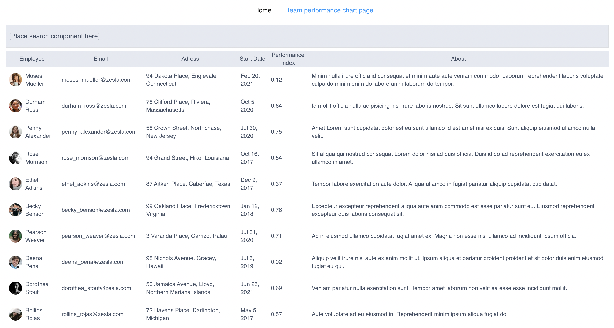
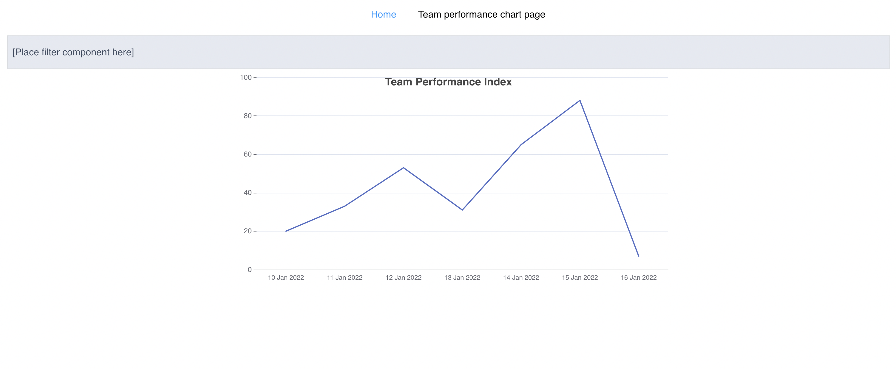

# Instabug take-home task

### Completed Requirements:
- Req #1 - Sales team table filter.
- Req #2 - Performance page date filter.
- Req #3 - Chart Edits.
- Req #4 - 404 Page in using ui-router.
- (BONUS #2) Load more button.
- (BONUS #3) Create `build` command to generate dist folder.

### Description
You recently joined a company that uses an internal system to monitor the performance of its sales team. They are currently use [Vuejs](https://v2.vuejs.org/) and [Angularjs](https://docs.angularjs.org/guide/introduction), and they need to implement some requirements

The application consists of two pages
- On the home page, there is a table that names all members of the sales team.

- the performance-chart page, which provides a simple chart showing the team's performance during the previous week.

below are the steps to install the dashboard and a the list of requirements.

### Installation
- copy the content of compressed file, then navigate to the output folder.
- run `yarn install`
- run `yarn start`

### Before You Begin:
- Create a github repository and commit the sent task files as the first commit.
- Use git and the commit messages that make sense
- Make a single Pull Request (PR) for each of the requirements listed. The title of the requirement should be used to name the pull request.

### Requirements
#### Req #1 - Sales team table filter:
  Using Vuejs we need to create a filter component
  - **Given** I'm a user **When** I type a string inside the filter text input **Then** I should see the matching string highlighted in the employees table "Employee" and "About" columns.

  - **Given** I'm a user **When** I modify the filter text input **Then** I should see the changes reflected in the page url.
  for example, normal page url `http://localhost:8080/`, when add search string, url should be `http://localhost:8080/?filter=[YOUR_SEARCH_STRING]`

  - **Given** I'm a user **When** I modify the filter text input and copy the page url **Then** I should see the search string highlighted in the employees table "**Employee**", "**Address**" and "**About**" columns.
  (Refeer to below animated screenshot)
  

  - **Given** I'm a user **When** I click on the `Clear` button **Then** the filter text input and page url should reset to the inital state.

  ##### take into account the following:
  - Integrate the built filter component with empoylees table - built in angularjs and uses [ng-repeat](https://docs.angularjs.org/api/ng/directive/ngRepeat) to render all tables rows - using [ngVue](https://github.com/ngVue/ngVue) (you can refer to performance page as it has same logic).
  - use [angularjs custom filter](https://docs.angularjs.org/tutorial/step_11) to implement the highlight functionality.
---
#### Req #2 - Performance page date filter
  - A chart built with [echarts](https://echarts.apache.org/en/index.html) library can be found on the page `/team-performance`.
  1. Current chart implementation uses static data, use **Axios** and **[Vuex](https://vuex.vuejs.org/)** to fetch team performance data from endpoint https://fe-task.getsandbox.com/performance, and replace it with the static data already set.

  2. To select a specific range on the chart, use browser default date range input to filter the fetched data.
      - You can make a simple two-text box with date validation and manually enter the date.
      - Create a JavaScript function that accepts the filter start and end dates as parameters and returns the chart points that exist between them; the end date chart data should be included in the output.
  
  3. Write a unit test for the filter function you just implemented above (jest is already included in dependencies)

      ##### Team performance request
      endpoint: https://fe-task.getsandbox.com/performance
      method: GET

      **Response:**

            [{
              date_ms: DATE_IN_UNIX_FORMAT,
              performance: PERFORMANCE_INDEX
            },
            ...
            ]
---
#### Req #3 - Chart Edits:
  1. The chart line should be styled to reflect the design below, and the graph line should indicate the performance ranges. (*you can pick the correct color codes from below screenshot*)
      - Red: For a score of less than 50%
      - Yellow: for a score of 50% to 80%
      - Green: For a score of more than 80%
  2. Match the tooltip to the design; it should provide the point's date as well as the relative performance index colour and value.

  **To implement the following, check the** [library documentation](https://echarts.apache.org/en/index.html):

  

---

#### Req #4 - 404 Page in using ui-router:
  - Create a not-found page with vuejs, as shown on the 'about' page.
  - To handle unknown routes, use [ui-router](https://ui-router.github.io/ng1/), which should redirect to the not found page you just created.
---
#### (BONUS #1) Install cypress and automate one of the following scenarios:
  - First Scenario
    - open home page
    - mock the employees request
    - assert employees data is apearing
    - assert on team perofrmance page link text and href
  - Second Scenario
    - open home page
    - mock the employees request
    - click load more button
    - assert on request is sent with correct params
    - assert on data appended to table correctly

---

#### (BONUS #2) Load more button:
  - Implement the logic of the load more button.
  - While loading data, add a loader indicator to the button and disable it to prevent multiple clicks.
  - When there are no more pages to load, hide the button.
  - The 'total pages' count can be seen in the request of employees.

    ##### Employee list request
    endpoint:https://fe-task.getsandbox.com/employees
    method: GET
    params:
    - `?page` [int]: number of current page, if not passed will return the first page
    - `?isPartTime` [bool]: return only part time employees, if not passed, will return all employees

    **Response:**

        {
            pages: TOTAL_PAGES_COUNT,
            current_page: CURRENT_PAGE_NUMBER,
            employees: LIST_OF_EMPLOYEES
        }

#### (BONUS #3) Create `build` command to generate dist folder.

---

### Preferred:
- Fix any CSS, and javascript be consistent in the way of writing your code
- Follow the guidelines mentioned bellow or your own guidelines

### Guidelines
- [Vuejs v2 style guide](https://v2.vuejs.org/v2/style-guide)
- BEM & SMACSS in writing you scss code.
